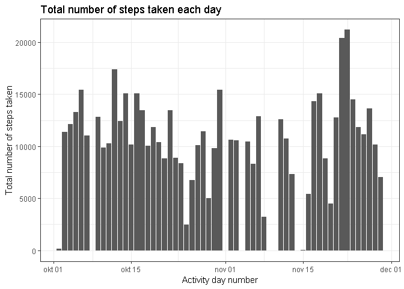

## Loading and preprocessing the data

```r
unzip("./activity.zip", exdir = "dataset")
rawData = read.csv("./dataset/activity.csv", header = TRUE, na.strings = "NA", 
                    colClasses = c("integer", "Date", "integer"))
```

## Histogram of the total number of steps taken each day

```r
library(dplyr); library(lubridate); library(ggplot2)
```

```
## 
## Attaching package: 'dplyr'
```

```
## The following objects are masked from 'package:stats':
## 
##     filter, lag
```

```
## The following objects are masked from 'package:base':
## 
##     intersect, setdiff, setequal, union
```

```
## 
## Attaching package: 'lubridate'
```

```
## The following object is masked from 'package:base':
## 
##     date
```

```r
proData1 = rawData %>% 
    group_by(date) %>% 
    summarize(StepsEachDay = sum(steps))

g <- ggplot(proData1, aes(date, StepsEachDay))
    g + geom_histogram(stat = "identity") + theme_bw() + 
    labs(x = "Activity day number", y = "Total number of steps taken", 
    title = "Total number of steps taken each day")
```

```
## Warning: Ignoring unknown parameters: binwidth, bins, pad
```

```
## Warning: Removed 8 rows containing missing values (position_stack).
```

<!-- -->

## What is mean total number of steps taken per day?
### Mean:

```r
proData1 %>% summarize(MeanStepsDay = mean(StepsEachDay, na.rm= T ))
```

```
## # A tibble: 1 x 1
##   MeanStepsDay
##          <dbl>
## 1       10766.
```

### Median:

```r
proData1 %>% summarize(MeanStepsDay = median(StepsEachDay, na.rm= T ))
```

```
## # A tibble: 1 x 1
##   MeanStepsDay
##          <int>
## 1        10765
```

## What is the average daily activity pattern?

```r
proData2 = rawData %>%
    group_by(interval) %>%
    summarize(MeanSteps = mean(steps, na.rm = T))

g2 <- ggplot(proData2, aes(interval, MeanSteps))
    g2 + geom_line() + theme_bw() + 
    labs(x = "5-minute intervals", y = "Average number of steps taken", 
    title = "5-minute interval and the average number of steps taken")
```

<!-- -->
    
### 5-minute interval with maximum number of steps on average across all the days:

```r
proData2$interval[which.max(proData2$MeanSteps)]
```

```
## [1] 835
```

## Imputing missing values
### Total number of missing values in the dataset

```r
colSums(is.na(rawData))
```

```
##    steps     date interval 
##     2304        0        0
```

### Decision: Impute missing values with mean for that 5-minute interval

```r
impuData = rawData %>% 
    group_by(interval) %>% 
    mutate(steps = ifelse(is.na(steps), mean(steps, na.rm = TRUE), steps))
```

### Histogram of the total number of steps taken each day on imputed data set

```r
proData3 = impuData %>%
    group_by(date) %>%
    summarize(StepsEachDay = sum(steps))

g3 <- ggplot(proData3, aes(date, StepsEachDay))
    g3 + geom_histogram(stat = "identity") + theme_bw() + 
    labs(x = "Activity day number", y = "Total number of steps taken", 
    title = "Total number of steps taken each day (imputed data)")
```

```
## Warning: Ignoring unknown parameters: binwidth, bins, pad
```

<!-- -->

### Mean (imputed data):

```r
proData3 %>% summarize(MeanStepsDay = mean(StepsEachDay, na.rm= T ))
```

```
## # A tibble: 1 x 1
##   MeanStepsDay
##          <dbl>
## 1       10766.
```

### Median (imputed data):

```r
proData3 %>% summarize(MeanStepsDay = median(StepsEachDay, na.rm= T ))
```

```
## # A tibble: 1 x 1
##   MeanStepsDay
##          <dbl>
## 1       10766.
```

#### Difference in mean between raw and imputed data:

```r
proData3 %>% summarize(Steps = mean(StepsEachDay, na.rm= T )) - proData1 %>% summarize(Steps = mean(StepsEachDay, na.rm= T ))
```

```
##   Steps
## 1     0
```
There is no difference in steps. Imputing logically keeps the mean steps equal.


#### Difference in median between raw and imputed data:

```r
proData3 %>% summarize(Steps = median(StepsEachDay, na.rm= T )) - proData1 %>% summarize(Steps = median(StepsEachDay, na.rm= T ))
```

```
##      Steps
## 1 1.188679
```
There is a relative small difference in steps. Imputing increases median steps.

## Are there differences in activity patterns between weekdays and weekends?

```r
weekend = c("zaterdag", "zondag")
proData4 = impuData %>% 
    mutate(weekPart = ifelse(weekdays(date) %in% weekend, "weekend",                     "weekday"))
proData4$weekPart <- factor(proData4$weekPart)

library(lattice)
proData5 = proData4 %>% 
    group_by(weekPart, interval) %>% 
    summarize(MeanStepswP=mean(steps))

xyplot(MeanStepswP~interval | weekPart, data = proData5, 
       xlab = "5-minute interval", ylab = "Average number of steps taken", 
       main = "Activity patterns during weekdays and weekend", type = "l")
```

<!-- -->
